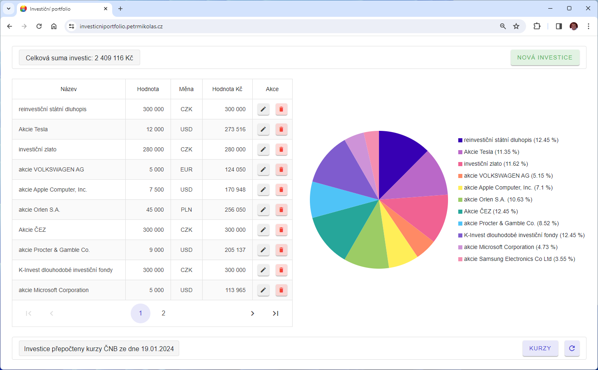
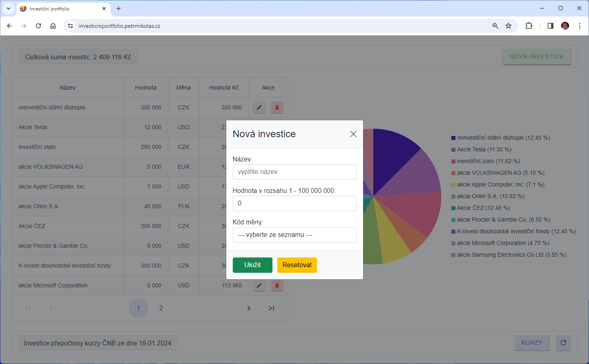
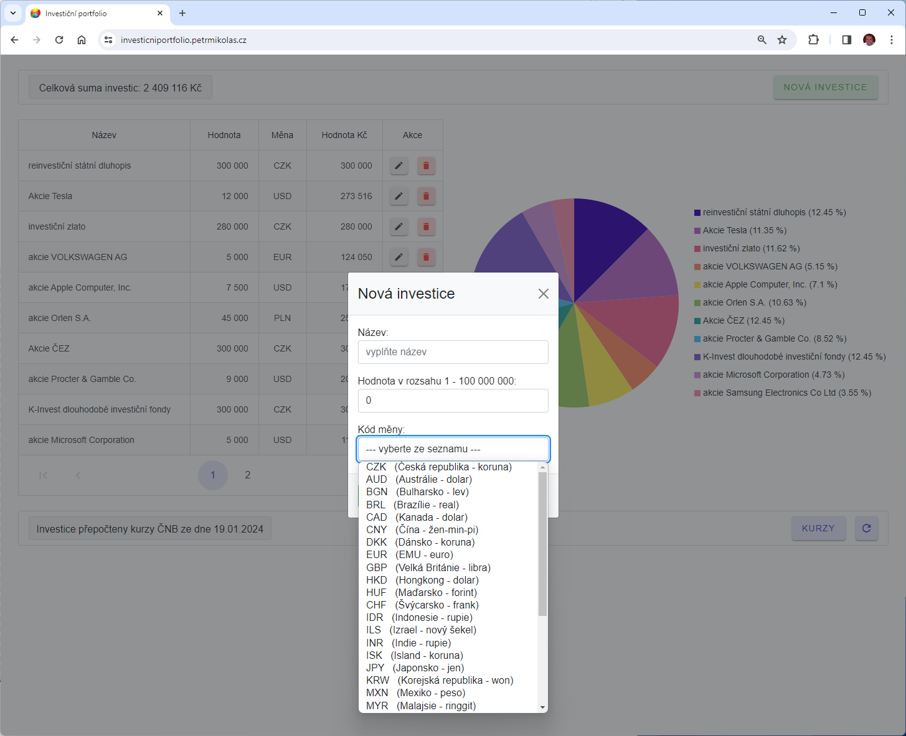
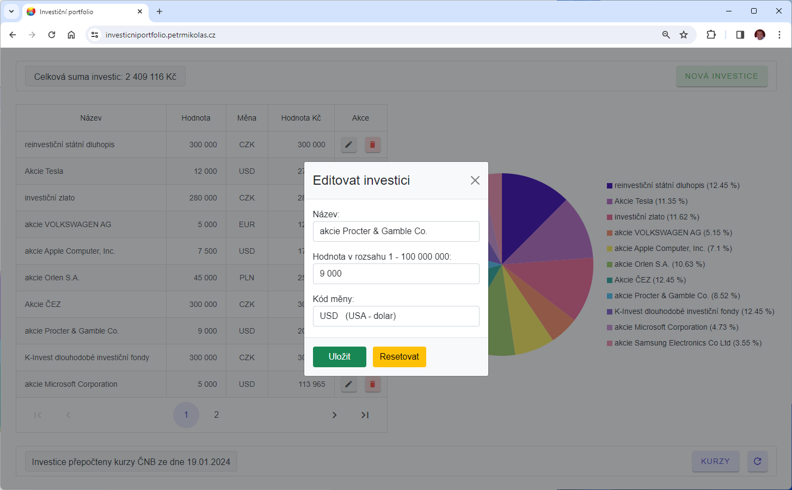
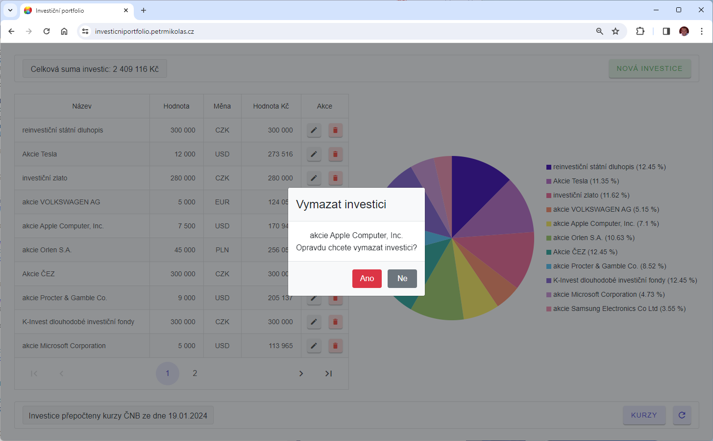
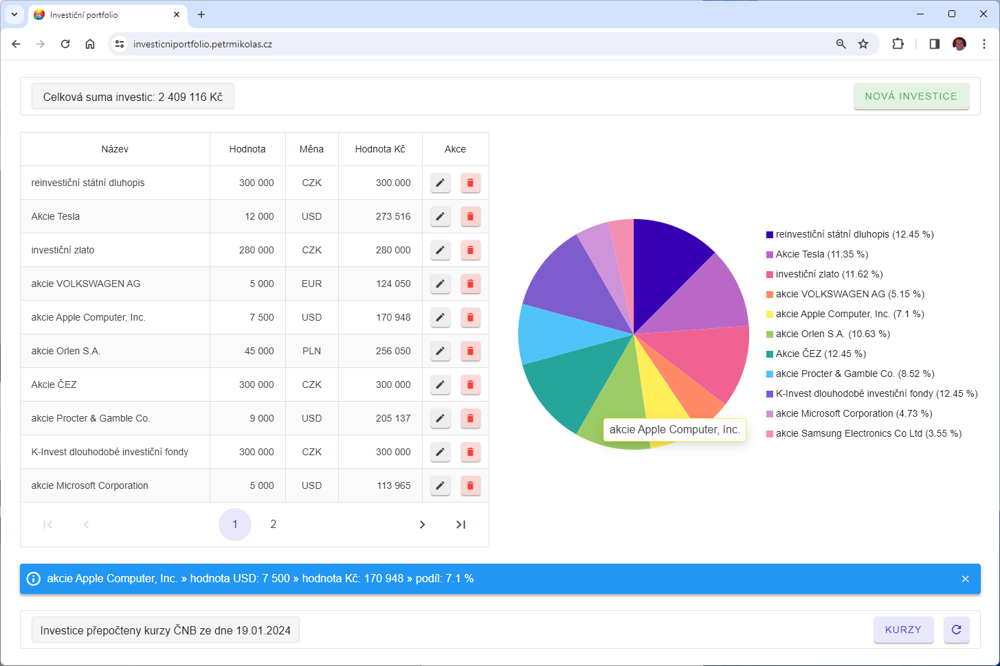
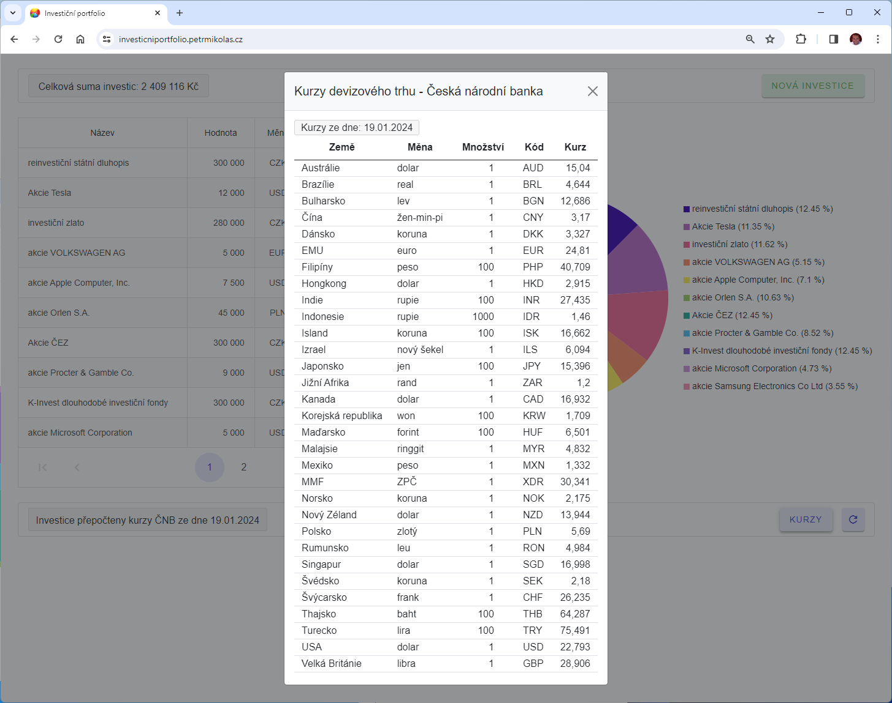
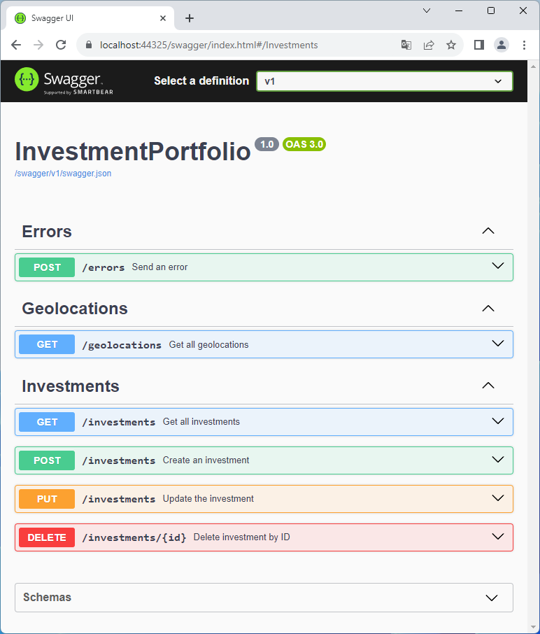

# Investiční portfolio

Webová Aplikace pro evidenci investic, stahování aktuálních devizových kurzů z API České národní banky a přepočet investic v cizí měně na Kč. Přehled investic je zobrazen ve výsečovém grafu.

Naprogramováno v jazyce C# v prostředí Microsoft .NET 8 

- App/Client - Blazor Web App 
- API - Minimal API
- Unit testy - NUnit
- Integrační testy - NUnit

