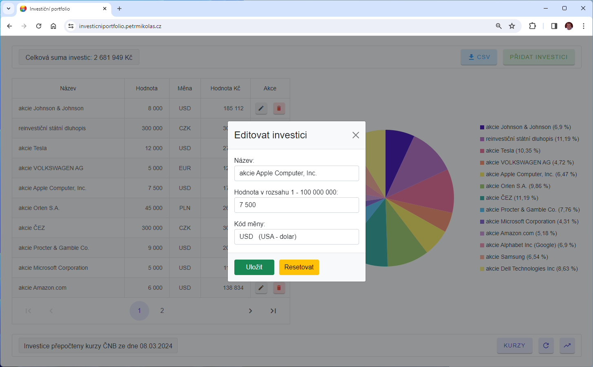
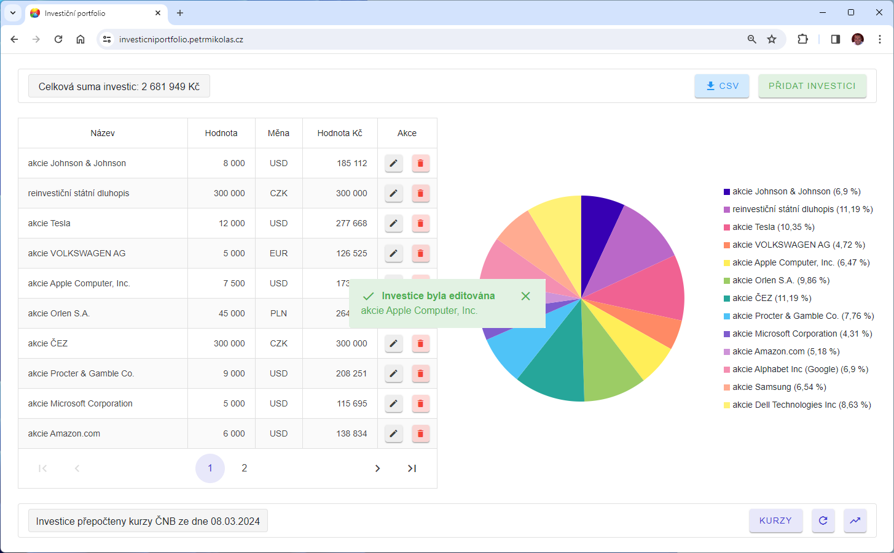
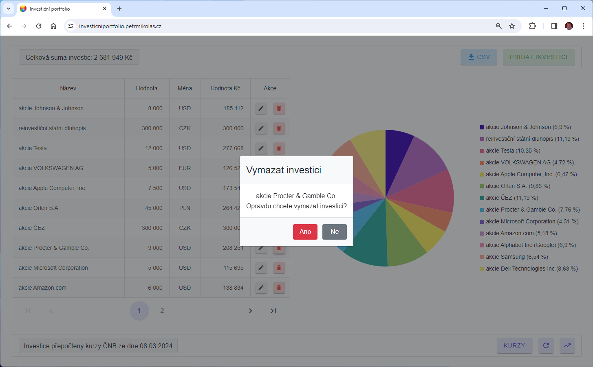
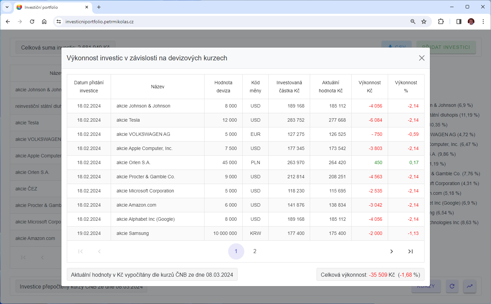
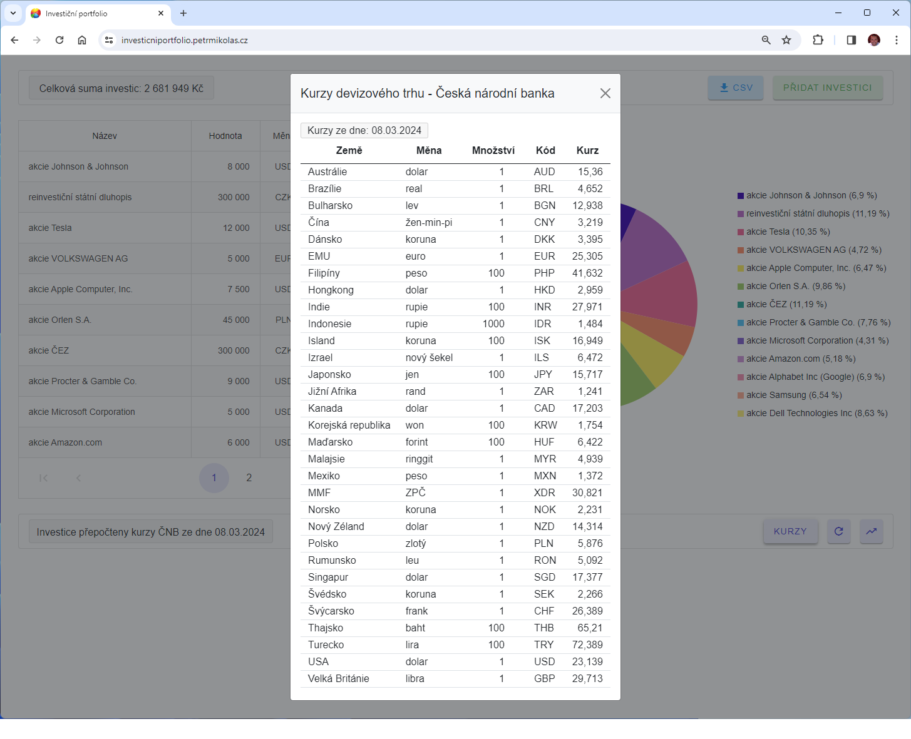
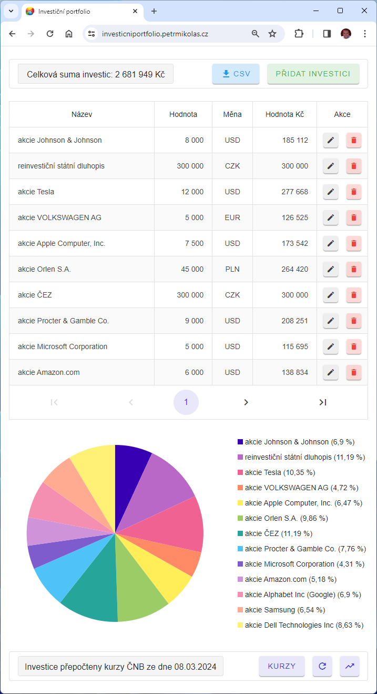

# Investiční portfolio

Webová aplikace pro evidenci investic, stahování aktuálních devizových kurzů z API České národní banky a přepočet investic v cizí měně na Kč. Přehled investic je zobrazen ve výsečovém grafu.

Naprogramováno v jazyce C# v prostředí Microsoft .NET 10 

- App/Client - ASP.NET Core (Blazor Web App) 
- API - Minimal API
- API dokumentace - OpenAPI
- ApiClient - NSwag
- Databáze - Microsoft SQL Server (MS SQL)
- ORM - Entity Framework Core (code-first)
- Unit testy - NUnit
- Integrační testy - NUnit
- Automatizované testy jsou spouštěny pomocí příslušných příkazů v Dockerfile během sestavování Docker kontejneru
- Nasazení - Docker kontejner pomocí Docker Compose
- Sledování chyb - Sentry

